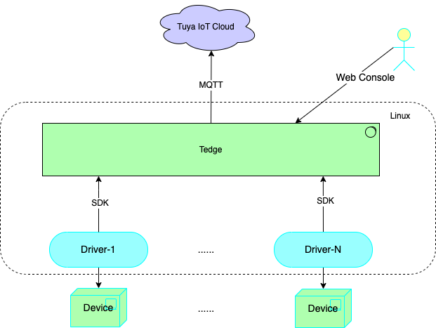

[English](README.md) | [中文版](README_CN.md)

# TEdge Southbound Driver Development SDK for Java

Tuya IoT Edge Gateway (TEdge) provides southbound driver SDK for Java named `tuya-tedge-driver-sdk-java`. This allows you to access third-party smart devices through TEdge southbound plug-ins.

## Architecture of TEdge



## Get started

### Add a dependency

* Add the latest SDK dependency v1.0.0. [download driver-sdk-jar](./target/tuya-tedge-driver-sdk-java-1.0.0.jar)
* maven dependency：Not currently supported

### Procedure

1. Follow the [example](#sample) and implement the driver interface `DPModelDriver`.
2. Package the driver into a Docker container.

For more information, see [Driver Demo on GitHub](https://github.com/tuya/tuya-tedge-driver-java-example) and [Driver Development Guide](./docs/summary.md).

### DPModelDriver API

```java
public interface DPModelDriver {
    // The callback to invoke when a sub-device is added, activated, updated, or deleted in the TEdge console.
    void deviceNotify(DeviceNotifyType deviceNotifyType, DeviceInfo deviceInfo);

    // The callback to invoke when a product is added, updated, or deleted in the TEdge console.
    void productNotify(ProductNotifyType productNotifyType, ProductInfo productInfo);

    // The callback to invoke when a command is received and forwarded over MQTT in the following direction: Tuya IoT Cloud > TEdge > Sub-device
    void handleCommands(String cid, CommandRequest request, Map<String, ProtocolProperties> propertiesMap, Map<String, DpExtend> dpExtendMap);

    // The callback to invoke when a driver instance is stopped from running in the TEdge console. The driver program can be recycled.
    void stop();
}
```

<a id="sample"></a>

### Example

```java
package dpdemo;

import dpdemo.dpdriver.DpDriverImpl;
//import dpdemo.mqttdriver.MqttDriverImpl;
//import tuya.tedge.driver.sdk.base.mqttitf.MqttDriver;
import tuya.tedge.driver.sdk.base.utils.PrintException;
import tuya.tedge.driver.sdk.dpmodel.DPModelDriver;
import tuya.tedge.driver.sdk.dpmodel.DpDriverService;

import lombok.extern.slf4j.Slf4j;

@Slf4j
public class Main {
    public static void main(String[] args) {
        try {
            // Step1: Create the DP model DpDriverService.
            DpDriverService driver = new DpDriverService(args);

            // Step2: Implement the API DPModelDriver and call setDpDriverImpl.
            DpDriverImpl driverImpl = new DpDriverImpl(driver.getDpDriverApi());
            DPModelDriver dpDriver = driverImpl;
            log.info("main set dpDriverImpl, start service!");

            // To integrate with MQTT devices, additionally implement the API MqttDriver and set the callback.
            //get mqtt username from customConfig
            //String username = "xxxx";
            //MqttDriver mqttDriver = new MqttDriverImpl();
            //driver.setMqttDriverImpl(mqttDriver, username);

            // Step3: Call `start`
            driver.start(dpDriver);

            // Step4: Implement basic features. For example, get configuration files, get activated sub-devices, add a product or sub-device, report the status of a sub-device, and report data point (DP) status.
            driverImpl.run();
        } catch (Exception e) {
            PrintException.printStack(e);
        }
    }
}
```

```java
// DpDriverImpl: Implement the API `public interface DPModelDriver`.
package dpdemo.dpdriver;

import tuya.tedge.driver.sdk.base.model.*;
import tuya.tedge.driver.sdk.dpmodel.DPModelDriver;
import tuya.tedge.driver.sdk.dpmodel.DpDriverApi;
import tuya.tedge.driver.sdk.dpmodel.model.CommandRequest;
import tuya.tedge.driver.sdk.dpmodel.model.DeviceInfo;
import tuya.tedge.driver.sdk.dpmodel.model.DpExtend;
import tuya.tedge.driver.sdk.dpmodel.model.ProductInfo;

import lombok.extern.slf4j.Slf4j;
import com.alibaba.fastjson.JSON;
import com.alibaba.fastjson.JSONObject;

import java.util.HashMap;
import java.util.Map;
import java.util.concurrent.ConcurrentHashMap;

// DpDriverImpl: Implement the required API `public interface DPModelDriver`.
// The interface is defined in the SDK `tuya.tedge.driver.sdk.dpmodel.DPModelDriver`.
@Slf4j
public class DpDriverImpl implements DPModelDriver {
    private Map<String, DeviceShadow> deviceMap;
    private DpDriverApi sdk;

    public DpDriverImpl(DpDriverApi sdk) {
        this.sdk = sdk;
        this.deviceMap = new ConcurrentHashMap<>();
    }

    // After startup, first initialize a list of existing sub-devices.
    public void run() {
        //......
        //TODO: implement me
    }

    /**
     * The callback to invoke when a sub-device is added, activated, updated, or deleted in the TEdge console.
     * Set the implementation of the interface to nil if you do not need to manually add sub-devices to the target gateway in the TEdge console.
     * Note: Do not perform blocking operations with the interface.
     */
    @Override
    public void deviceNotify(DeviceNotifyType deviceNotifyType, DeviceInfo device) {
        log.info("deviceNotify type:{},device:{}", deviceNotifyType.getValue(), device.toString());
        //......
        //TODO: implement me
    }

    /**
     * ProductNotify: the callback to invoke when a product is added, updated, or deleted. If a product is deleted, the `product` parameter is empty.
     * Do not perform blocking operations with the interface.
     */
    @Override
    public void productNotify(ProductNotifyType productNotifyType, ProductInfo productInfo) {
        log.info("productNotify type:{}, product:{}", productNotifyType.getValue(), productInfo.toString());
    }

    /**
     * The callback to invoke when a driver instance is updated or stopped from running on TEdge. The driver program can be recycled.
     */
    @Override
    public void stop() {
        //......
        //TODO: implement me
    }

    /**
     * The messages sent by TEdge or the cloud over MQTT.
     * Note: Do not perform blocking operations with the interface.
     */
    @Override
    public void handleCommands(String cid, CommandRequest commandRequest, Map<String, ProtocolProperties> map, Map<String, DpExtend> map1) {
        log.info("handleCommands cid：{}, handleCommands:{}", cid, commandRequest);
        //......
        //TODO: implement me
    }
}
```

### MqttDriver API

* When you use the driver program to integrate with MQTT devices, you do not need to implement the MQTT broker. TEdge and the SDK already provides respective capabilities.
* You need to implement the MQTTDriver API `public interface MqttDriver`.

    The MqttDriver API is defined in `import tuya.tedge.driver.sdk.base.mqttitf.MqttDriver`.

    ```java
    public interface MqttDriver {
        // Auth: the MQTT authentication event. A value of `true` indicates successful authentication.
        Boolean auth(String clientId, String username, String password);

        // Sub: the MQTT subscription event. A value of `true` indicates a successful subscription.
        Boolean subscribe(String clientId, String username, String topic, Byte qos);

        // Pub: the MQTT publish event. A value of `true` indicates successful publishing.
        Boolean publish(String clientId, String username, String topic, Byte qos, Boolean retained);

        // UnSub: unsubscribe from an MQTT topic.
        void unSubscribe(String clientId, String username, String[] topics);

        // Connected
        void connected(String clientId, String username);

        // Closed
        void closed(String clientId, String username);
    }
    ```

### Implement the MqttDriver API (MQTT)

```java
// Implement the MqttDriver API.

package dpdemo.mqttdriver;

import tuya.tedge.driver.sdk.base.mqttitf.MqttDriver;
import lombok.extern.slf4j.Slf4j;

@Slf4j
public class MqttDriverImpl implements MqttDriver {
    @Override
    public Boolean auth(String clientId, String username, String password) {
        log.info("mqtt auth clientId:{},username:{},password{}", clientId, username, password);
        //TODO: implement me
        return true;
    }

    @Override
    public Boolean subscribe(String clientId, String username, String topic, Byte qos) {
        log.info("mqtt Subscribe clientId:{},,username:{},topic:{},qos:{}", clientId, username, topic, qos);
        //TODO: implement me
        return true;
    }

    @Override
    public Boolean publish(String clientId, String username, String topic, Byte qos, Boolean retained) {
        log.info("mqtt publish clientId:{},,username:{},topic:{},qos:{},retained:{}", clientId, username, topic, qos, retained);
        //TODO: implement me
        return true;
    }

    @Override
    public void unSubscribe(String clientId, String username, String[] topics) {
        log.info("mqtt unSubscribe clientId:{},,username:{},topics:{}", clientId, username, topics);
        //TODO: implement me
    }

    @Override
    public void connected(String clientId, String username) {
        log.info("mqtt connected clientId:{},,username:{}", clientId, username);
        //TODO: implement me
    }

    @Override
    public void closed(String clientId, String username) {
        log.info("mqtt closed clientId:{},,username:{}", clientId, username);
        //TODO: implement me
    }
}
```

## SDK API

* The SDK defines the following API: `import tuya.tedge.driver.sdk.dpmodel.DpDriverApi;`.
* The SDK defines the following data structures:

    - `import tuya.tedge.driver.sdk.base.model.*;`
    - `import tuya.tedge.driver.sdk.dpmodel.model.*;`

### SDK core API

```java
public interface DpDriverApi {
    /**
     * Returns custom configuration items in expert mode.
     *
     * @return JSONObject
     */
    JSONObject getCustomConfig();

    /**
     * Adds and activates a device.
     *
     * @param deviceMetadata
     * @return
     */
    ActiveDeviceResponse activeDevice(DeviceMetadata deviceMetadata);

    /**
     * SetDeviceExtendProperty: updates extension properties of a sub-device. The latest property values will overwrite the earlier ones during repeated calls.
     *
     * @param cid
     * @param deviceUpdateProperty
     */
    Boolean setDeviceProperty(String cid, DeviceUpdateProperty deviceUpdateProperty);

    /**
     * setDeviceBaseAttr: renames a sub-device after the sub-device is activated with `activeDevice`.
     *
     * @param cid
     * @param deviceUpdateProperty
     */
    Boolean setDeviceBaseAttr(String cid, DeviceUpdateProperty deviceUpdateProperty);

    /**
     * Deletes a sub-device.
     *
     * @param cid
     */
    void deleteDevice(String cid);

    /**
     * Reports the online status of the sub-device.
     *
     * @param deviceStatus
     */
    void reportDeviceStatus(DeviceStatus deviceStatus);

    /**
     * Reports DP status of the sub-device.
     *
     * @param cid
     * @param dpDataList
     */
    void reportWithDPData(String cid, List<DpData> dpDataList);

    /**
     * Returns all sub-devices that are associated with the driver.
     *
     * @return
     */
    Map<String, DeviceInfo> allDevices();

    /**
     * Returns all activated sub-devices that are associated with the driver.
     *
     * @return
     */
    Map<String, DeviceInfo> getActiveDevices();

    /**
     * Returns device information by device ID.
     *
     * @param cid
     * @return
     */
    DeviceInfo getDeviceById(String cid);

    /**
     * Adds a product.
     *
     * @param productMetadata
     */
    Boolean addProduct(ProductMetadata productMetadata);

    /**
     * Returns all products that are associated with the driver.
     * @return
     */
    Map<String, ProductInfo> allProducts();

    /**
     * Returns product information by product ID.
     *
     * @param productId
     * @return
     */
    ProductInfo getProductById(String productId);

    /**
     * reportAlert : The driver reports alert information.
     *
     * @param alertLevel
     * @param content
     */
    void reportAlert(AlertLevel alertLevel, String content);

    /**
     * getServiceId: returns the driver instance ID.
     */
    String getServiceId();

    /**
     * getGatewayInfo: returns gateway information.
     */
    GatewayInfo getGatewayInfo();

    ////////////////////////////////////////////////////////////////////////////////////////
    /**
     * ReportThroughHttp: reports custom messages over HTTP.
     *
     * @param api
     * @param version
     * @param payload
     * @return
     */
    String reportThroughHttp(String api, String version, Map<String, Object> payload);

    /**
     * CmdRespSuccess: indicates a success response. Consult the business staff about the usage.
     *
     * @param sn
     */
    void cmdRespSuccess(Long sn);

    /**
     * cmdRespFail: indicates a failure response. Consult the business staff about the usage.
     *
     * @param sn
     * @param message
     */
    void cmdRespFail(Long sn, String message);

    /**
     * uploadFile: uploads an image or file.
     *
     * @param content
     * @param fileName
     * @param subjectType
     * @param timeout
     * @return
     */
    String uploadFile(byte[] content, String fileName, String subjectType, Integer timeout);

    ////////////////////////////////////////////////////////////////////////////////////////////////
    //Mqtt driver api
    Boolean Publish(String topic, byte[] payload, Byte qos, Boolean retained);

    Boolean SubScribe(String topic, Byte qos, IMqttMessageListener listener) throws MqttException;

    Boolean UnSubscribe(String topic);

    ////////////////////////////////////////////////////////////////////////////////////////////////
    // GetKV: returns stored custom content of the driver by key.
    Map<String, byte[]> GetKV(String[] keys);

    // PutKv: stores the custom content of the driver.
    Boolean PutKv(Map<String, byte[]> kvs);

    // DeleteKV: deletes stored custom content of the driver by key.
    Boolean DeleteKV(String[] keys);

    // GetKVKeys: filters keys by prefix. All keys are returned if an empty value is passed.
    String[] GetKVKeys(String prefix);

    // QueryKV: queries key-value storage by prefix. All storage data is returned if an empty value is passed.
    Map<String, byte[]> QueryKV(String prefix);

    // GetKVOne: returns content by key. Cloud backups are not supported.
    byte[] GetKVOne(String key);

    // PutKVOne: stores custom content of the driver. Cloud backups are not supported.
    Boolean PutKVOne(String key, byte[] value);

    // GetBackupKV: returns key-value storage by key. Cloud backups are supported.
    Map<String, byte[]> GetBackupKV(String[] keys);

    // GetBackupKV: returns key-value storage by key. Cloud backups are supported.
    byte[] GetBackupKVOne(String key);

    // GetBackupKVKeys: returns keys by prefix. All keys are returned if an empty value is passed. Cloud backups are supported.
    String[] GetBackupKVKeys(String prefix);

    // PutBackupKV: updates the key-value storage. Cloud backups are supported.
    Boolean PutBackupKV(Map<String, byte[]> kvs);

    // PutBackupKVOne: updates the key-value storage. Cloud backups are supported.
    Boolean PutBackupKVOne(String key, byte[] value);

    // DelBackupKV: deletes the key-value storage. Cloud backups are supported.
    Boolean DelBackupKV(String[] keys);

    // QueryBackupKV: queries the key-value storage by prefix. All storage data is returned if an empty value is passed. Cloud backups are supported.
    Map<String, byte[]> QueryBackupKV(String prefix);

    /**
     * Registers the driver web service.
     *
     * @param proxyInfo
     */
    void RegistDriverProxy(ProxyInfo proxyInfo);
}
```

## Technical support

- [Tuya Developer Platform](https://developer.tuya.com/)
- [Help Center](https://support.tuya.com/en/help)
- [Service & Support](https://service.console.tuya.com/)
