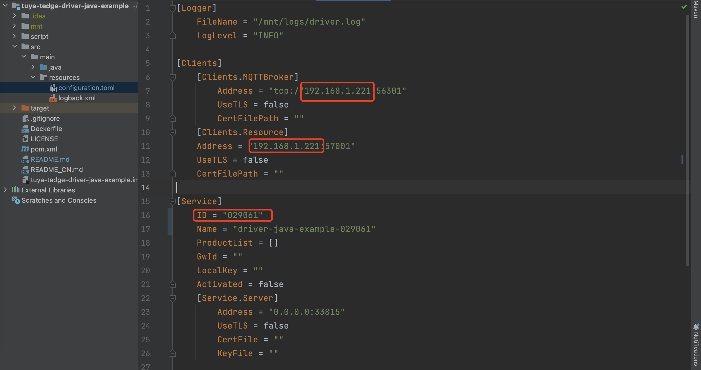
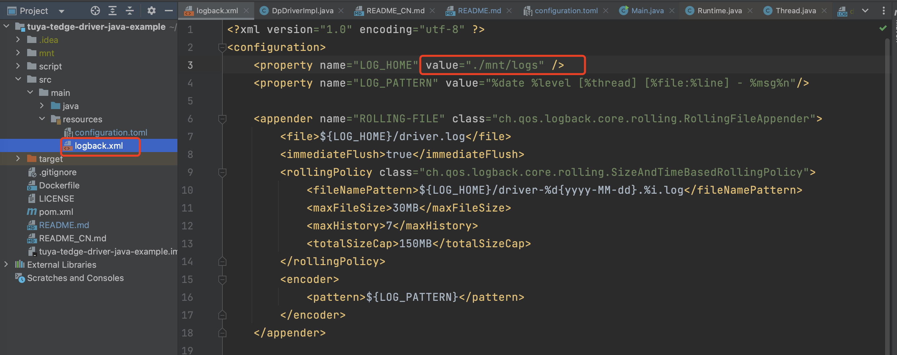
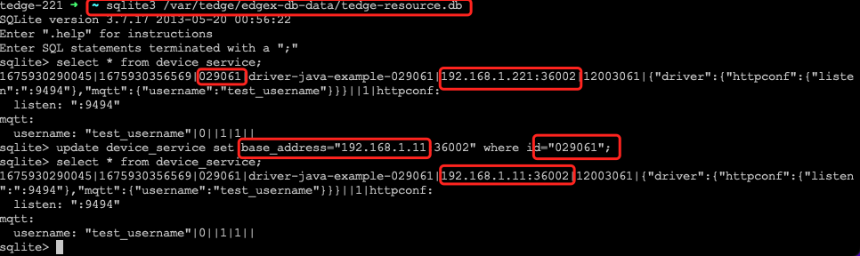

# 一、模拟云端下发MQTT消息
驱动程序开发过程中，不可能随时让客户端同学协助下发设备指令，Tedge提供了两种方式模拟云端下发指令
- 子设备功能点调试：
    - 依次点击`设备管理`-`子设备管理`-`功能点`，选择有`下发`字段的功能点
    - 功能点数据传输类型为`可上报、可下发`时`下发`字段可用。这里选择功能点46，输入期望值100，点击确定即可
    
    
- 通过调试助手，构造完整的MQTT消息
    
    
- 这两种方式都可以模拟云端向子设备下发指令，简单数据类型如bool、value、enum可以用第一种方式，复杂类型可以用第二种方式

# 二、查看驱动程序日志
在Web控制台上查看驱动程序日志，过滤日志不是太友好，我们可以直接在边缘网关Linux机器中查看驱动程序的完整日志
- 找到驱动实例名称：依次点击`服务管理`-`服务实例管理`，找到`实例名称`，在我的网关上为：`driver-java-example-029061`
- ssh 登录 Linux 机器：`ssh root@192.168.1.x`
- `driver-java-example-029061` 对应的驱动日志文件为：`/var/tedge/edgex-driver-data/mnt/driver-java-example-029061/logs/driver.log`

# 三、使用IDEA本地调试驱动程序
通过上一章节的介绍，我们知道一个驱动程序必须打包成docker镜像的方式才能在Tedge上安装并运行，这在开发过程中不是很友好。
这里我们介绍一下，如何在IDEA中运行驱动程序。
- 前提条件：开发机必须和边缘网关处于同一个网段中，假设边缘网关IP为：`192.168.1.221`，本地开发机为：`192.168.1.11`
- 第一步：根据驱动开发范式，用最简的方式先完成一个驱动镜像，在Tedge中安装并运行驱动程序
- 第二步：停止该驱动程序，注意：这里必须先停止驱动程序运行
- 第三步：拷贝驱动程序配置文件，以 `driver-java-example-029061` 为例
  - 假设边缘网关机器IP地址为：先通过 `ssh root@192.168.1.221` 登录边缘网关后台
  - 该驱动实例的配置文件位置为：`/var/tedge/edgex-driver-data/run-config/driver-java-example-029061.toml`
  - 拷贝一份该配置文件，重命名为 `configuration.toml`，并将该文件移动到JAVA项目目录：`src/main/resources/configuration.toml`
- 第四步：修改 `configuration.toml` 中相应字段：
  - 将Client配置项中的MQTTBroker和Resource的IP地址修改为，边缘网关IP地址：`192.168.1.221`
  - 注意：Service配置项中的ID字段，是由Tedge边缘网关自动生成的，不得更改，必须使用第三步中拷贝出来的值
- 第五步：修改日志输出目录：
  - 修改 `src/main/resources/logback.xml`: 修改日志目录为 `./mnt/logs`，直接在当前项目中输出日志，方便查看：
- 第六步：登录边缘网关后台，修改数据库中，驱动实例`driver-java-example-029061`的IP地址：
  - sqlite3 /var/tedge/edgex-db-data/tedge-resource.db
  - update device_service set base_address="192.168.1.221:36002" where id="029061";
  - 说明：默认情况下，驱动实例的IP地址为 127.0.0.1，这里要修改成开发机IP，以便驱动程序和Tedge边缘网关进行通信；
- 第七步：编译并运行程序，即可在本地IDEA中运行驱动程序，并进行调试；

上一章：[DP模型驱动开发指南](./developdp.md)

下一章：[DP驱动SDK常用API](./sdkapi.md)
