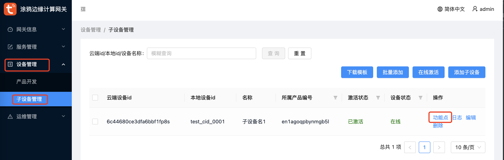
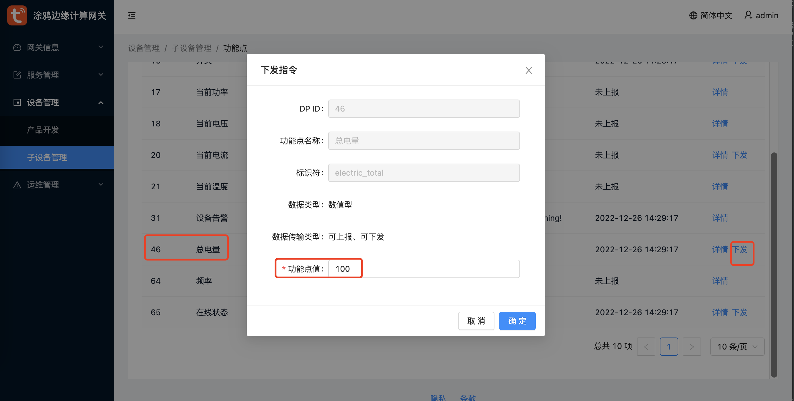
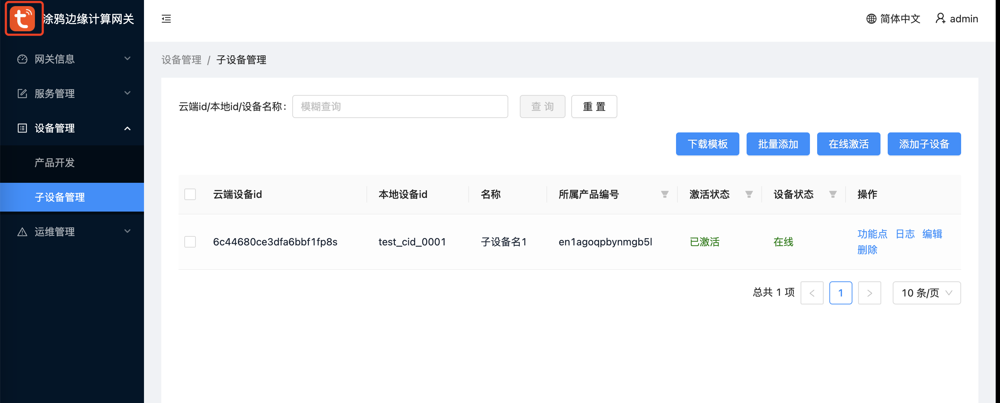
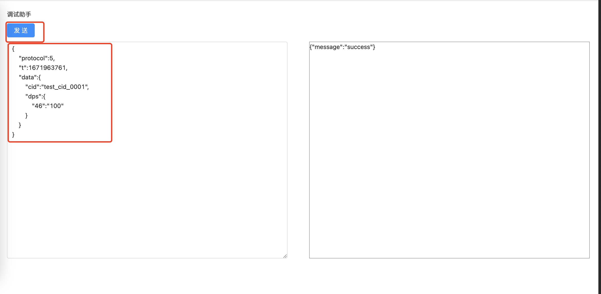

# 一、模拟云端下发MQTT消息
驱动程序开发过程中，不可能随时让客户端同学协助下发设备指令，Tedge提供了两种方式模拟云端下发指令
- 子设备功能点调试：
    - 依次点击`设备管理`-`子设备管理`-`功能点`，选择有`下发`字段的功能点
    - 功能点数据传输类型为`可上报、可下发`时`下发`字段可用。这里选择功能点46，输入期望值100，点击确定即可
    
    
- 通过调试助手，构造完整的MQTT消息
    
    
- 这两种方式都可以模拟云端向子设备下发指令，简单数据类型如bool、value、enum可以用第一种方式，复杂类型可以用第二种方式

# 二、查看驱动程序日志
在Web控制台上查看驱动程序日志，过滤日志不是太友好，我们可以直接在Linux机器中查看驱动程序的完整日志
- 找到驱动实例名称：依次点击`服务管理`-`服务实例管理`，找到`实例名称`，在我的网关上为：`driver-java-exmaple-713459`
- ssh 登录 Linux 机器：`ssh root@192.168.1.x`
- `driver-java-exmaple-713459` 对应的驱动日志文件为：`/var/tedge/edgex-driver-data/mnt/driver-java-exmaple-713459/logs/driver.log`

# 三、使用二进制方式调试驱动程序
通过上一章节的介绍，我们知道一个驱动程序必须打包成docker镜像的方式才能在Tedge上安装并运行，这在开发过程中不是很友好。
这里我们介绍一下，如何在IDEA中运行驱动程序。
- 第一步：根据驱动开发范式，用最简的方式先完成一个驱动镜像，在Tedge中安装并运行驱动程序
- 第二步：停止该驱动程序，必须停止
- 第三步：拷贝驱动程序配置文件，以 `driver-java-exmaple-713459` 为例
    - 该驱动实例的配置文件为：`/var/tedge/edgex-driver-data/run-config/driver-java-exmaple-713459.toml`
    - 拷贝一份该配置文件，重命名为 `configuration.toml`，并将该文件移到到 `src/main/resources/configuration.toml`
    - 修改 `configuration.toml` 中如下字段：
    - 修改 `src/main/resources/logback.xml`: 修改日志目录为 ``
    - 编译并运行程序，即可在本地运行驱动程序
- 特别说明：如上开发调式方式，要求驱动程序的二进制文件必须和Tedge服务在同一台Linux机器中；若期望在其它机器上运行驱动程序，请联系开发同学；

上一章：[DP模型驱动开发指南](./developdp.md)

下一章：[DP驱动SDK常用API](./sdkapi.md)
