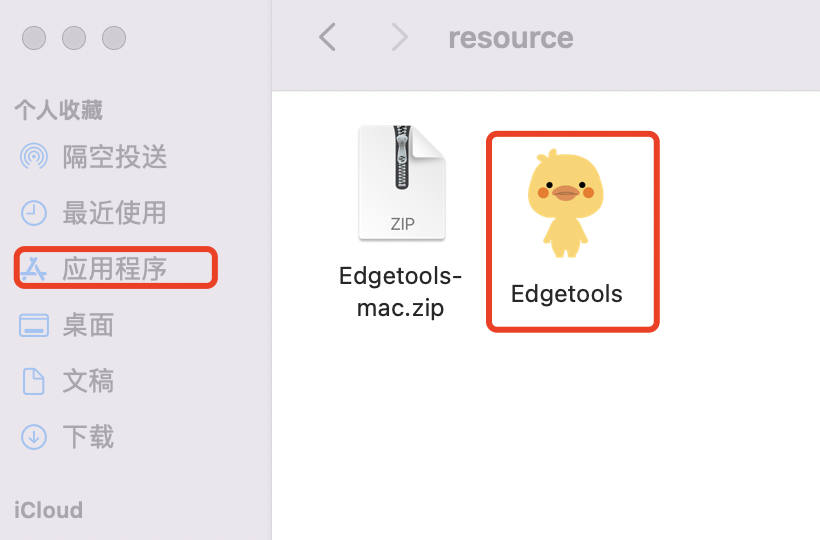
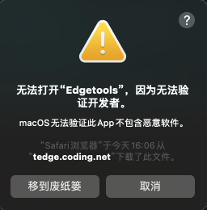
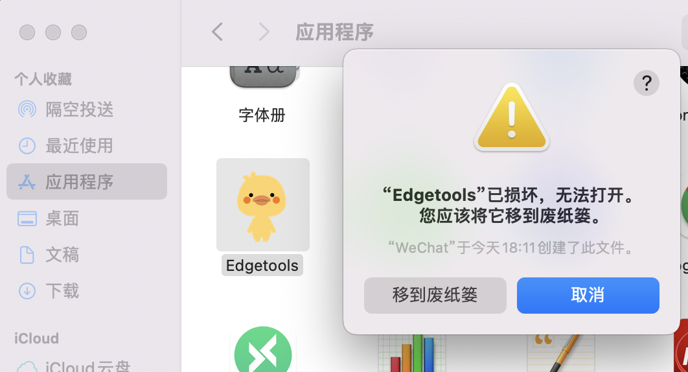
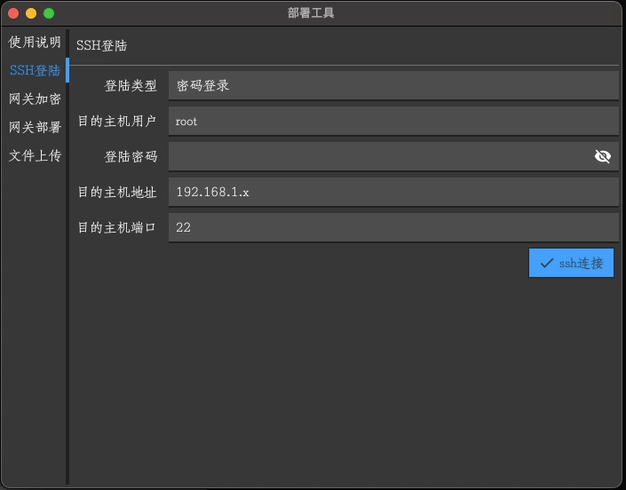
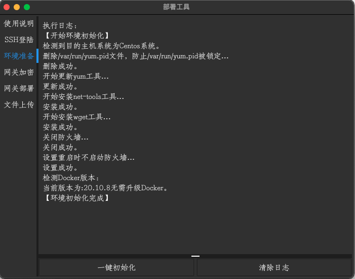
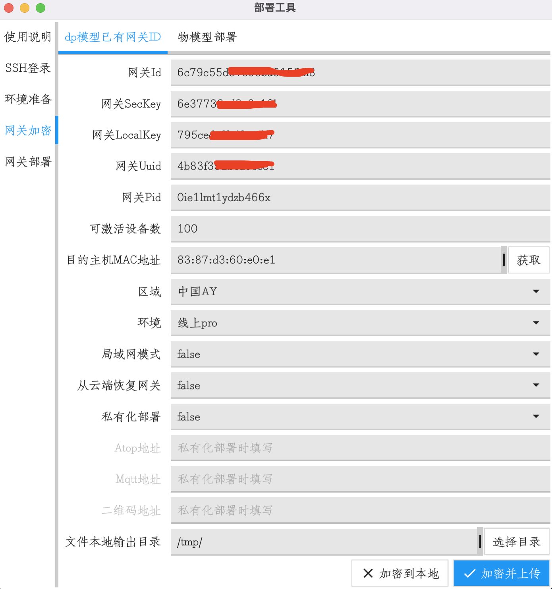
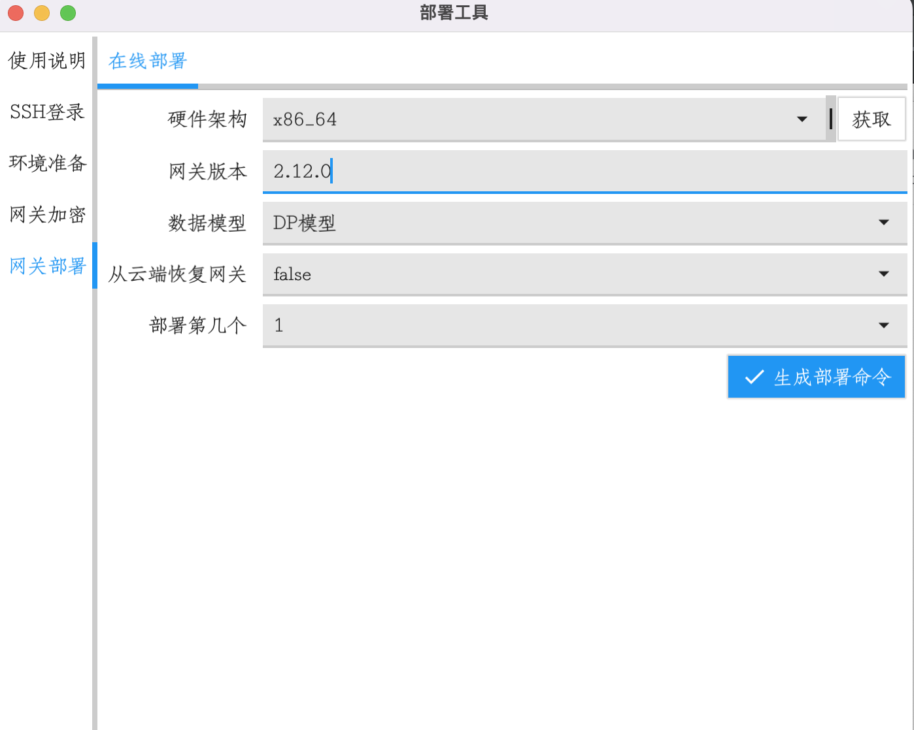

# 1 环境依赖
## 1.1 运行环境
- 硬件配置：最低1核、512MB内存。
- 平台架构：x86、armv7 。
- 操作系统：Centos、Ubuntu。
- 软件依赖：Docker 20.10.0 以上

## 1.2 关闭SELinux
```bash
#不需要手动操作，可通过安装工具配置

# SELINUX=enforcing 改为 SELINUX=disabled
vim /etc/sysconfig/selinux 
```

## 1.3 关闭防火墙
Centos 版本系统：
```bash
#不需要手动操作，可通过安装工具配置

#关闭防火墙
systemctl stop firewalld
systemctl disable firewalld
```

Ubuntu 系统版本：
```bash
#不需要手动操作，可通过安装工具配置

#安装ufw工具
apt-get install -y ufw
#关闭防火墙
ufw disable
```

## 1.4 安装Docker
```
#不需要手动操作，可通过安装工具安装
#Docker版本不低于20.10.0

# 设置Docker开机启动
systemctl enable docker
#启动Docker
systemctl start docker
```

# 2 安装部署Tedge
- 第一步：下载安装工具
- 第二步：初始化系统环境
- 第三步：生成网关配置文件
- 第四步：部署边缘网关服务

## 2.1 第一步：下载安装工具

### MacOS 系统安装：
- MacOS 安装包下载：<a href="https://airtake-public-data-1254153901.cos.ap-shanghai.myqcloud.com/tedge/tool/Edgetools-mac.zip" target="_blank">网关部署工具MacOS</a>

- 解压缩后，将 Edgetools 移动到 "应用程序"：

- 如果安装后提示如下类似内容：
    - 打开`系统偏好设置`-> `安全性与隐私` -> `通用` -> `仍要打开`。

- 如果无上述选项，提示如下警告：
    - 打开"终端"，切换到压缩包解压后的目录，执行 `xattr -r -d com.apple.quarantine Edgetools.app`，完成后再将 Edgetools 移动到 "应用程序"。

### Windows 系统安装：
- Windows 安装包：<a href="https://airtake-public-data-1254153901.cos.ap-shanghai.myqcloud.com/tedge/tool/Edgetools-win.zip" target="_blank">网关部署工具Windows</a>
- windows 版下载，右键解压，进入解压目录后，`右键`->`管理员权限运行`。

### 特别说明
- 如果 mac 版本不可用，建议使用 window 电脑进行安装。

## 2.2 第二步：初始化系统环境(可略过)

### a.通过SSH连接边缘网关

后续的网关加密、网关部署会需要远程获取一些信息。当然也可以不登陆，手动填入这些信息。


- 登陆类型：密码登陆
- 用户名：只支持root用户
- 密码：Linux系统密码。
- ip地址：Linux系统ip地址。
- ssh端口：默认是22。

### b.进行环境初始化

点击环境准备、一键初始化，等待结果即可，此步骤只需要进行一次。若初始化环境失败，可参考`1 环境依赖`手动初始化。



## 2.3 第三步：生成网关配置文件

### a.部署DP模型网关



- 网关id：与SecKey、LocalKey互为三元组，必须同时存在，找涂鸦对接的同学要。
- SecKey：与网关id、LocalKey互为三元组，必须同时存在，找涂鸦对接的同学要。
- LocalKey：与网关id、SecKey互为三元组，必须同时存在，找涂鸦对接的同学要。
- 网关uuid：非必填项；
- 网关pid：网关本身也是一个产品，默认 pid 为 "0ie1lmt1ydzb466x"。
- 可激活设备数：网关下允许接入的子设备最大数量。
- 目的主机mac地址：目的主机的网卡地址，多个网卡时随机选择一个，当ssh已登陆可随机获取一个。
- 区域：根据实际情况选取，默认为中国区。
- 环境：根据实际情况选取，默认为生产环境；开发阶段建议选择预发环境，不要选择日常环境！！！
- 说明：若"网关id/SecKey/LocalKey"三元组正确无误，部署成功完成后就处于激活状态！

将如上所有信息填好后，点击加密并上传(确保ssh已登陆)。

## 2.4 第四步：部署边缘网关

网关部署，根据不同操作系统生成不同的数据脚本，填入数据后点击生成部署命令，点击一键部署，等待部署完成。


- 硬件架构：目的主机的芯片架构，只支持 `x86_84`、`armv7`，如果ssh已登陆可以直接点击获取。
- 网关版本：最低支持部署的版本为 2.12.0;
- 数据物模：即Tedge模式，可选DP模型和物模型，默认为DP模型
- 部署第几个：一个Linux环境中，支持部署5个Tedge实例；

下一章：[边缘网关操作介绍](./tedgeweb.md)

上一章：[边缘网关介绍](./introduction.md)
