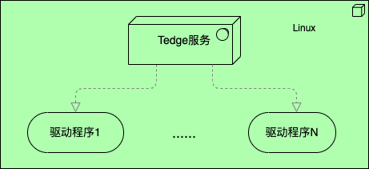

# 1. 了解 Tedge

## 1.1 Tedge 简介
- Tedge：涂鸦边缘计算网关，由网关盒子 + 网关服务 + 设备驱动程序三部分组成；
- 网关盒子：任何 x86 或 armv7 架构并安装了 linux(centos7/ubuntu) 的机器；
- 网关服务: Tedge 服务，边缘网关的软件程序包；
- 设备驱动程序: 通过SDK开发的程序称为设备驱动程序，驱动程序是用来连接子设备和Tedge的桥梁；

## 1.2 Tedge适用场景
- 设备接入：Tedge用于将第三方设备接入到涂鸦云，这些设备本身不具体连接涂鸦云的能力(Not Powered by Tuya);
- 设备控制：通过边缘网关，控制 工业场景类的设备，通过行业通用协议可以访问或控制此类设备；
- 数据采集：通过边缘网关，采集设备的运行数据，并将运行数据实时上传到涂鸦云；
- 设备种类：比如常见的各种摄像头、车行系统、门禁系统、梯控系统、水电表、环境监控类设备等等；
- 部署环境：Tedge边缘网关通常部署在客户的机房中，远离涂鸦云，所以称为边缘网关；
- 网络环境：驱动程序，即边缘网关所在网络环境必须能够和真实设备进行通信
    - 驱动程序可通过TCP、HTTP、MQTT等常见协议与真实设备直接相连并通信
    - 驱动程序可通过设备提供的SDK与真实设备连接并通信
    - 驱动程序可通过设备网关与真实设备进行通信
    - 驱动程序可通过设备云服务与真实设备进行通信
    - 驱动程序可通过串口线等物理介质与真实设备进行通信

## 1.3 Tedge是如何工作的
- Tedge服务: 1.Tedge通过MQTT协议和涂鸦云连接并通信；2.接收云端下发的MQTT消息，并转发至驱动；3.接收驱动程序上报的消息，并上报至云端；
- 驱动程序: 1.连接真实设备，读取或接收设备的消息，转化格式并上报到Tedge；2.接收Tedge转发的消息，转化格式并下发至设备；
- MQTT消息下发：涂鸦云-->Tedge-->驱动(转化)-->设备
- MQTT消息上报：设备-->驱动(转化)-->Tedge-->涂鸦云
- 说明1：通常情况下，一个驱动程序只能接入一类设备。想将一种新的设备接入涂鸦云，必须开发一个此设备的驱动程序；
- 说明2：通常我们可以通过设备提供的SDK、或TCP、或HTTP、或MQTT协议来连接和控制真实设备；

# 2.Tedge运行模式和版本
- Tedge支持两种运行模式：1.DP模型协议; 2.物模型协议(TuyaLink)；
- Tedge运行模式在安装时就决定了，若不明确说明，Tedge运行模式为"DP模型协议"；
- 同理，驱动SDK也支持两种模式，驱动程序运行模式必须和Tedge保持一致；
- Tedge版本：目前维护的最低版本为v2.12.0；
- 注意：JAVA SDK 目前只支持DP模型协议

下一章：[边缘网关部署](./install.md)