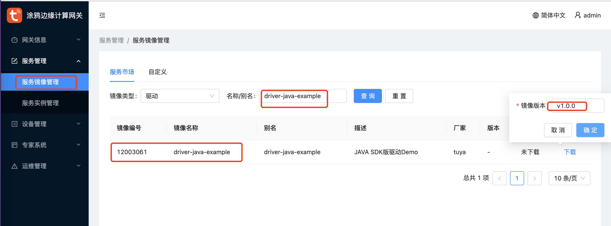
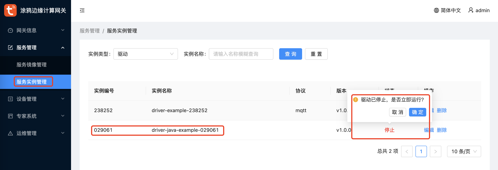
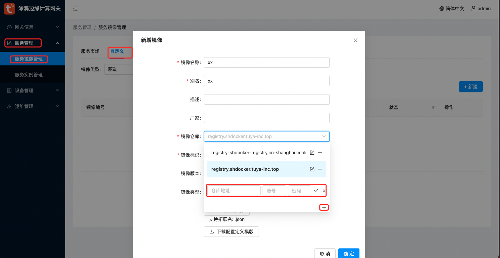
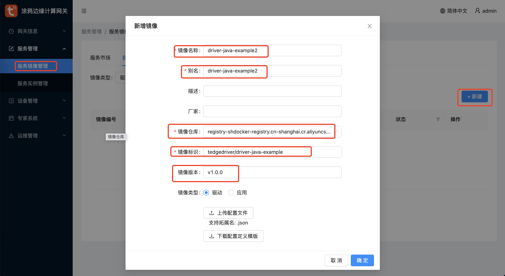
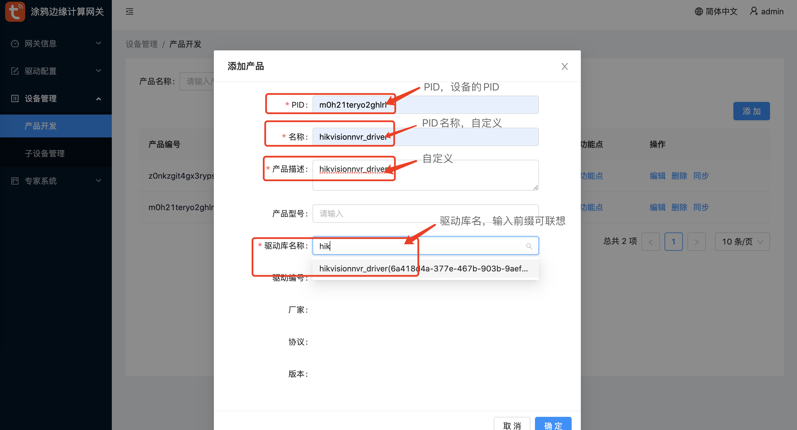
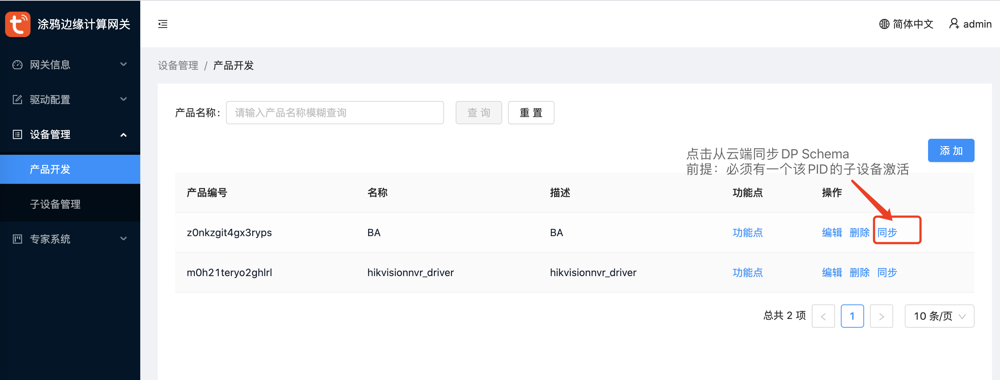
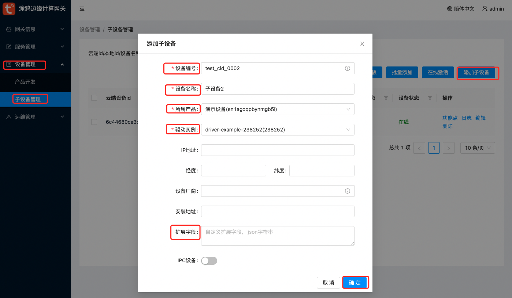
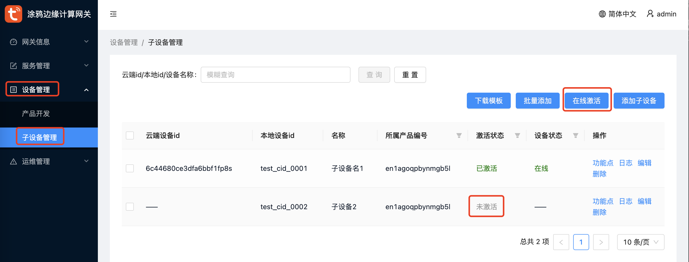
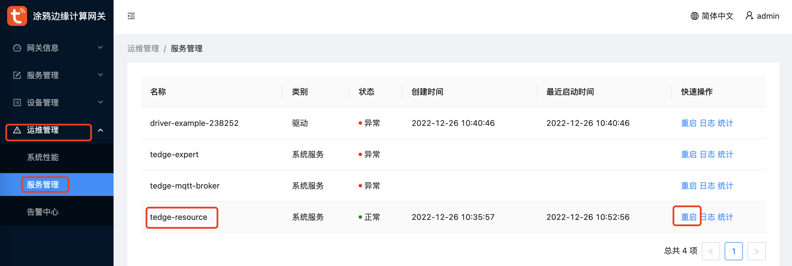
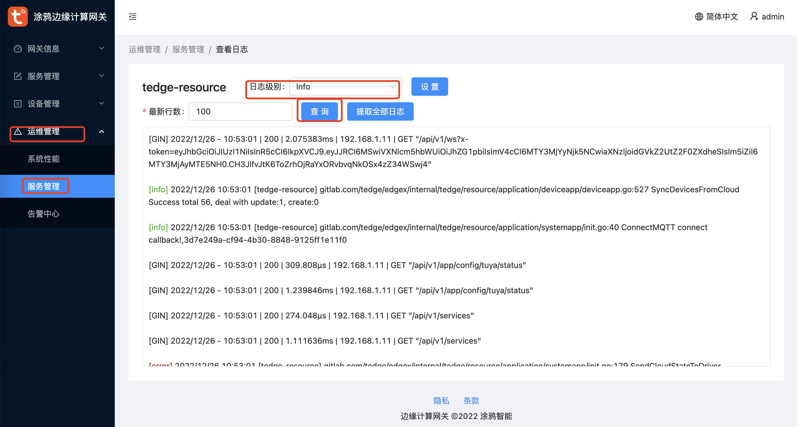

# Tedge Web控制台操作指南
假设你已经安装部署好了一个Tedge服务，我们简单介绍一下Tedge Web控制台的使用

- 一、Tedge Web控制台登录
- 二、安装和管理设备驱动程序
- 三、安装自定义驱动
- 四、产品和子设备管理
- 五、Tedge服务管理

## 一、Tedge Web控制台
- Tedge Web控制台地址：`http://192.168.1.x:3000`
- IP地址：安装Tedge服务的Linux机器的IP地址；
- 端口：默认为3000；从上一章安装指南，我们知道一个Linux环境支持安装5个Tedge实例；第2个到第5个实例的端口分别为：3002、3003、3004、3005；
- 默认用户名和密码：用户名：`admin`，密码：`Admin123!`

## 二、安装和管理驱动
- 安装官方驱动Demo：依次点击`服务管理`->`服务镜像管理`，查询 `driver-java-exmaple`，点击下载，选择版本；

- 驱动实例启动、停止：在`运维管理`-`性能看板`中，点击`tedge-resource`服务

## 三、安装自定义驱动
- 新增镜像仓库

- 安装自定义驱动

## 四、产品和子设备
### 产品管理
- 新增产品PID，产品必须和驱动库绑定，一个产品只能绑定一个驱动

- 同步产品信息，也即同步DP点信息

### 子设备管理
- 新增子设备: 依次点击 `设备管理`->`子设备管理`->`添加子设备`，注意图中标红字段，`扩展字段`为可选项，其余为必选项；

- 激活子设备: 依次点击 `设备管理`->`子设备管理`->`在线激活`，若激活失败请查看Tedge服务日志；

## 五、Tedge服务管理
- 重启Tedge，在`运维管理`-`性能看板`中，点击`tedge-resource`服务的重启按钮。

- 查看Tedge日志，在`运维管理`-`性能看板`中，点击`tedge-resource`服务的`日志`按钮查看日志。查看驱动程序日志同理。

下一章：[DP模型驱动开发指南](./develop/developdp.md)

上一章：[边缘网关部署](./install.md)